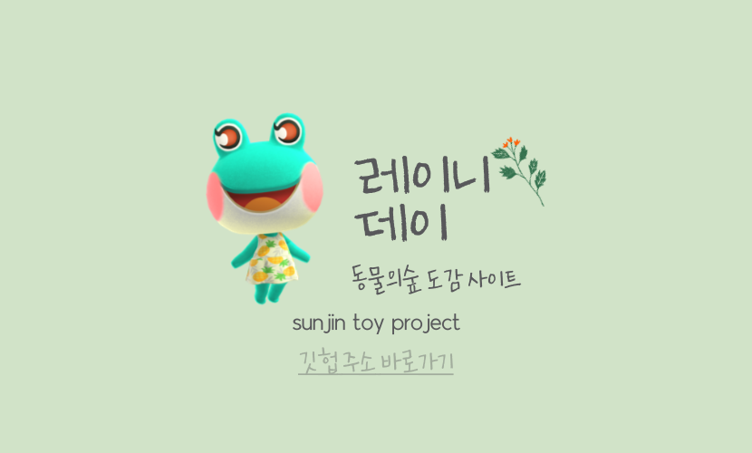
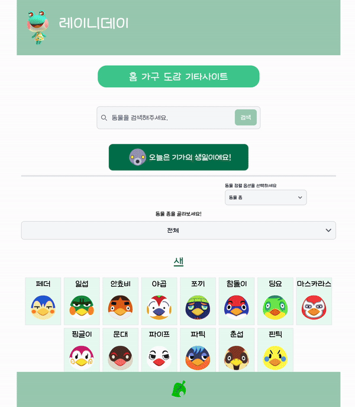

# 레이니데이 \_ 동물의 숲 도감 사이트

- 레이니데이는 동물의숲게임 도감 페이지 입니다.
  주민의 정보, 생물, 가구의 정보를 얻을수 있습니다 🙂

- 제작과정 블로그 : [👉 동물의숲 제작과정 벨로그 링크](https://velog.io/@badajinsee/series/Reacttoyproject)

## 🔗 Link

- 사이트 주소 : https://rainy2-day.vercel.app/

---

## 🔖 Preview

## Team

|  |
| :-----------------------------------------------------------------------------------------: |
|                 FE: sunjin [@badajinsee](https://github.com/badajinsee)                 |

## ⚙️ 개발환경

<h3 align="left"> Tools</h3>

    

- Recoil
- React-router
- React-spinners
- flowbite
